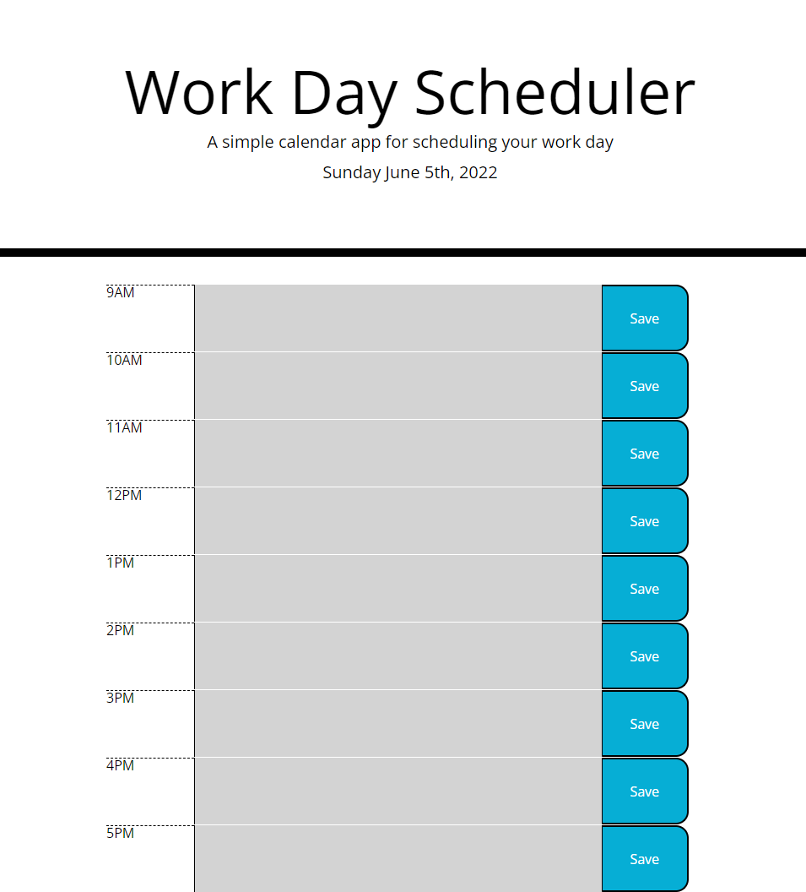

# Work Day Scheduler

## Description

A day planner for tasks taking place between 9:00AM through 5:00PM. Planner was built using a mix of HTML, CSS, JavaScript, and the JavaScript library of JQuery. By clicking any one of the input boxes a task can be written into that box. Once you click out of the box the text will stay, however, the text will not save unless you click the blue "Save" button. After clicking save, any text written in the input boxes will stay within the boxes even if you reload the page.

## Steps Taken

* Webpage foundation and style built using HTML and CSS

* Date in the header was grabbed using Moment.js

* Input boxes are color coded based on whether the boxes respective hour labels are in the past, present, or future. This was also made possible through the use of Moment.js

* Using JQuery, Save buttons were made specific to their respective rows, and if clicked will save any new text to the localStorage.

* Load function also inplemeted using JQuery. This will grab any existing text specific to each timeslot from the localStorage and plug it back into the input boxes.

## Webpage

Please feel free to visit the webpage at the link below or take a look at the screenshot below. Note, the date on the webpage will be live and not show "Sunday June 5th, 2022" as it does in the screenshot.

Link: https://stricker2.github.io/workday-scheduler/

## Contributors

Project was created by Andrew Secore